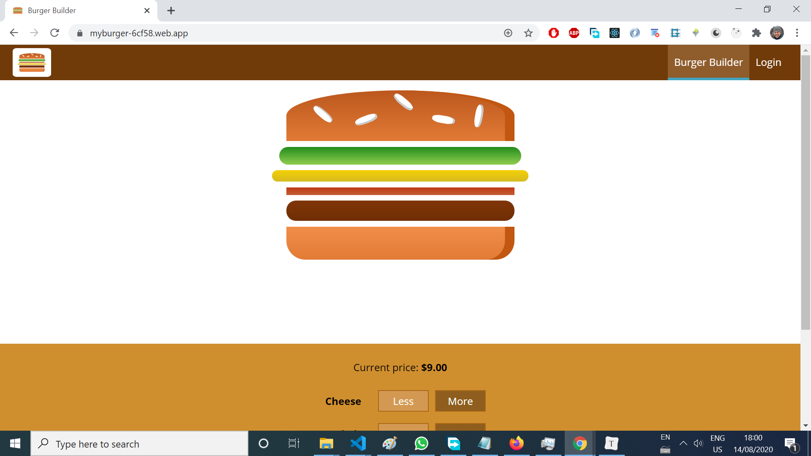
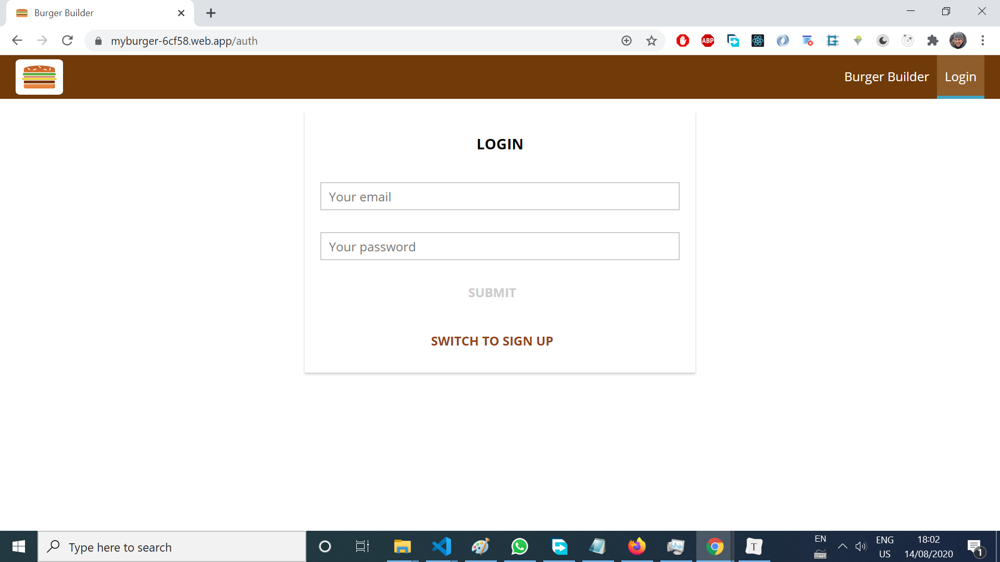
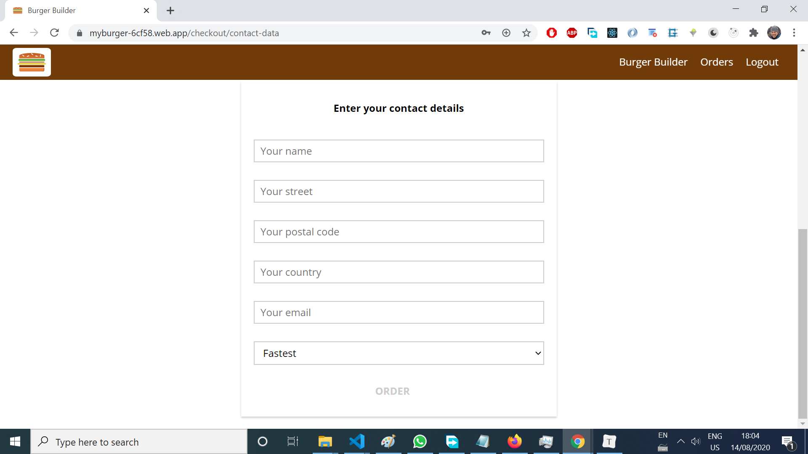
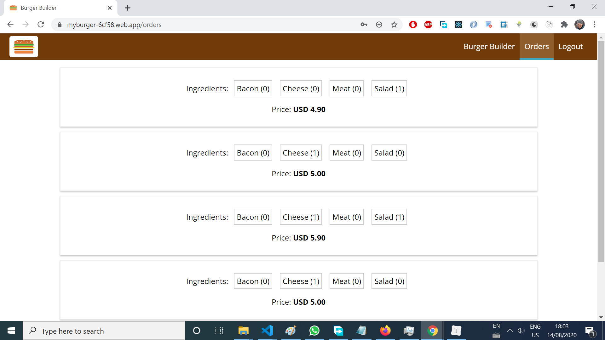

# Burger Builder
> A mobile responsive [React](https://github.com/facebook/react) app for ordering burgers online and seeing past orders stored in a database. Live app: https://burger-builder-rtc.firebaseapp.com/.


## Table of contents

* [General info](#general-info)
* [Screenshots](#screenshots)
* [Technologies](#technologies)
* [Setup](#setup)
* [Features](#features)
* [Status](#status)
* [Inspiration](#inspiration)
* [Contact](#contact)


## General info

This project was coded to learn [React](https://github.com/facebook/react) best practices and patterns. [Redux](https://github.com/facebook/react) was used to manage state and [redux-thunk](https://github.com/reduxjs/redux-thunk) was used to perform asynchronous tasks. There are **class based and functional components**.


## Screenshots

Image#1: Home screen




Image#2:  Login/Sign Up screen




Image#3: Checkout screen




Image#4: Orders screen




## Technologies

* [React](https://github.com/facebook/react) - version 16.13.1
* [Redux](https://github.com/reduxjs/redux) - version 3.7.2
* [Redux-thunk](https://github.com/reduxjs/redux-thunk) - version 2.2.0
* [Firebase Realtime Database](https://firebase.google.com/docs/database)


## Setup

* **Clone or download the repo.**

* **Run the app in the development mode.**

  In the project directory, you can run:  

  ```bash
  npm start
  ```

  Open [http://localhost:3000](http://localhost:3000) to view it in the browser.

  The page will reload if you make edits.

  You will also see any lint errors in the console.

* **Launch the test runner in the interactive watch mode:**

  ```bash
  npm test
  ```

  See the section about [running tests](https://facebook.github.io/create-react-app/docs/running-tests) for more information.

* **Build the app for production to the `build` folder:**

  ````bash
  npm run build
  ````

  It correctly bundles React in production mode and optimizes the build for the best performance.

  The build is minified and the filenames include the hashes.

  Your app is ready to be deployed!

  See the section about [deployment](https://facebook.github.io/create-react-app/docs/deployment) for more information.

* **If you aren’t satisfied with the build tool and configuration choices**:

  ````bash
  npm run eject
  ````

  **Note: this is a one-way operation. Once you `eject`, you can’t go back!**

  If you aren’t satisfied with the build tool and configuration choices, you can `eject` at any time. This command will remove the single build dependency from your project.

  Instead, it will copy all the configuration files and the transitive dependencies (webpack, Babel, ESLint, etc) right into your project so you have full control over them. All of the commands except `eject` will still work, but they will point to the copied scripts so you can tweak them. At this point you’re on your own.

  You don’t have to ever use `eject`. The curated feature set is suitable for small and middle deployments, and you shouldn’t feel obligated to use this feature. However we understand that this tool wouldn’t be useful if you couldn’t customize it when you are ready for it.


## Features
List of implemented features:
* Authentication
* Auto-logout when the token expires
* Form validation
* Save the current order and access the old ones from a Firebase Realtime Database

List of improvements that could be done:

* Calculate the burger price on the server.
* Edit or Cancel submitted orders
* Add sign up/login with Google and Facebook
* Integrate a payment  gateway

## Status
Project is _finished_. 

## Inspiration
This project was based on [Academind's `React: The Complete Guide`](https://pro.academind.com/p/react-the-complete-guide-incl-hooks-react-router-redux).

## Contact
Created by [Esteban Munch Jones](https://www.linkedin.com/in/estebanmunchjones/)- feel free to contact me.

